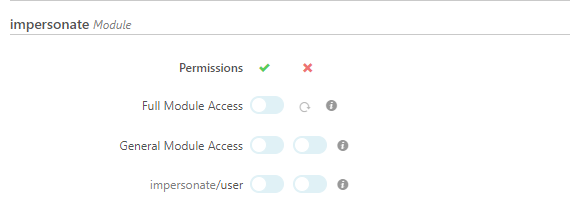

# Configuration 

## Module Configuration via IcingaWeb2  

There is no configuration needed but you can restrict access via roles

## Role setup 

The module provides the following permissions so you can decide who is allowed to impersonate a user:

